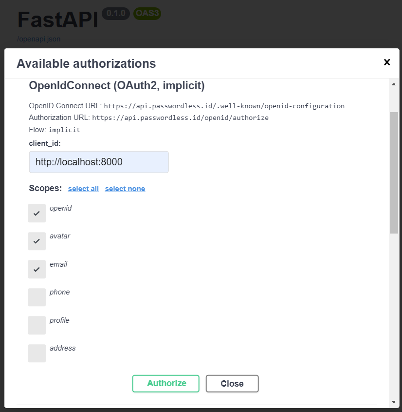
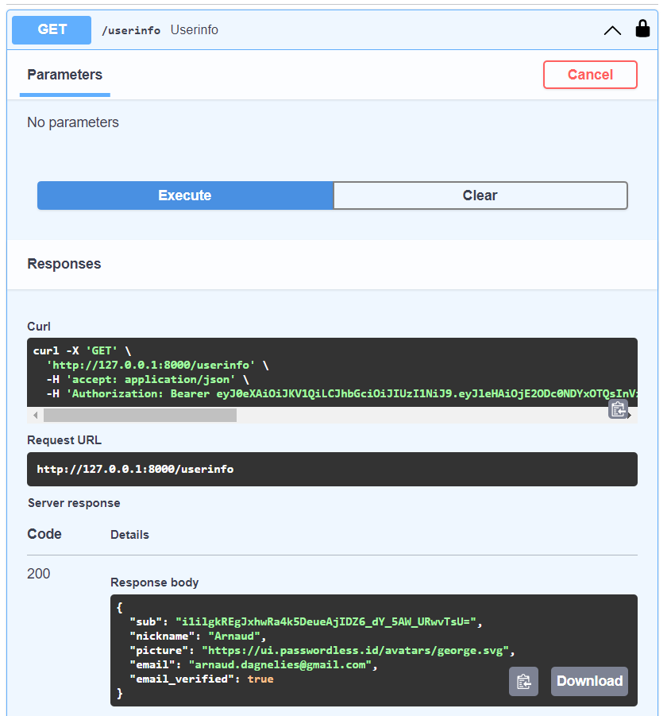

Passwordless.ID - FastAPI Demo
==============================

> This minimal example shows an integration between FastAPI and Passwordless.ID.

Source code: ...


Running it
----------

To run it: `uvicorn main:app`

And open http://localhost:8000/docs 

For authentication, you can choose either the implicit flow or the authorization code.
For both, the `client_id` should be your domain ("http://localhost:8000") in our case.




For the authorization code flow, ignore the `client_secret` and leave it empty. (That sounds fishy right? A section related to security concerns is at the end of this page)

Once you are authenticated and authorized access, you can return the user information server side.



The source code
---------------

The *whole app* is just this handful of lines.

```python
from typing import Annotated

from fastapi import Depends, FastAPI
from fastapi.security import OpenIdConnect
import requests

app = FastAPI()

openid = OpenIdConnect(openIdConnectUrl="https://api.passwordless.id/.well-known/openid-configuration")

@app.get("/userinfo")
async def userinfo(authHeader: Annotated[str, Depends(openid)]):
    res = requests.get('https://api.passwordless.id/openid/userinfo', headers = {"Authorization":authHeader})
    return res.json()
```

The `authHeader` contains a short lived *access token* that will expire after a short while.
It should be used during the sign-in process to fetch the user information (like username or email) and establish a normal user session.
This can be done either by setting a session ID cookie and keeping the user information in memory, using a database, using a self signed JWT or whatever.
How exactly this is done is left to your own preference. Lastly, maintaining your own user session avoids uselessly repating the request and make the experience more snappy for the user.
    


Security apects
---------------

Let's understand what is going on in this "authorization code" flow.

1. The OpenAPI docs page redirects to an URL like `https://api.passwordless.id/openid/authorize?...`
2. Once the user authenticated and granted permission to see it's profile, it's redirected back to the OpenAPI docs with a `code`
3. Server-side, python exchanges this `code` for an access `token`
4. With the `token`, you can send one more request to obtain the user profile

In the third step, where the *code* is exchanged for the access *token*, the server usually sends a `client_secret` too, to prove it's really him. This is to protect against attacks where your *code* was leaked, to prevent the attacker to get the *access token*.

For Passwordless.ID, this is mitigated by only allowing redirections back to the `client_id` requested. That already avoids the code being send somewhere else by an attacker tempering with `redirect_uri`.

Bottom line is that as long as your front-end is not compromised, the `code` should not get leaked. It is also a "nonce", which means that once exchanged for a *token*, it is "consumed" and cannot be used again. Lastly, the *token* too is rather short lived.

Security-wise, the *authorization code* flow without secret is still better than the *implicit flow*. While the first exposes an exchange *code* in the browser'S URL, the latter exposes the token and user profile directly, which would make stealing it much more convinient if your front-end is compromised.

For even better security, we recommend using the *authorization code* with PKCE. This is similar to dynamically created secrets. Using and verifying a nonce would also be an option since it is supported by Passwordless.ID. Sadly, neither is widely supported by FastAPI nor OpenAPI.